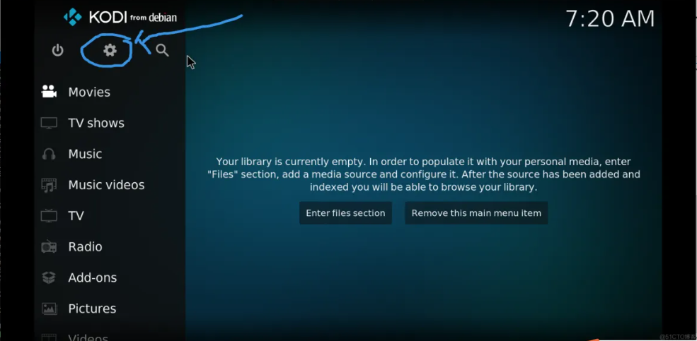
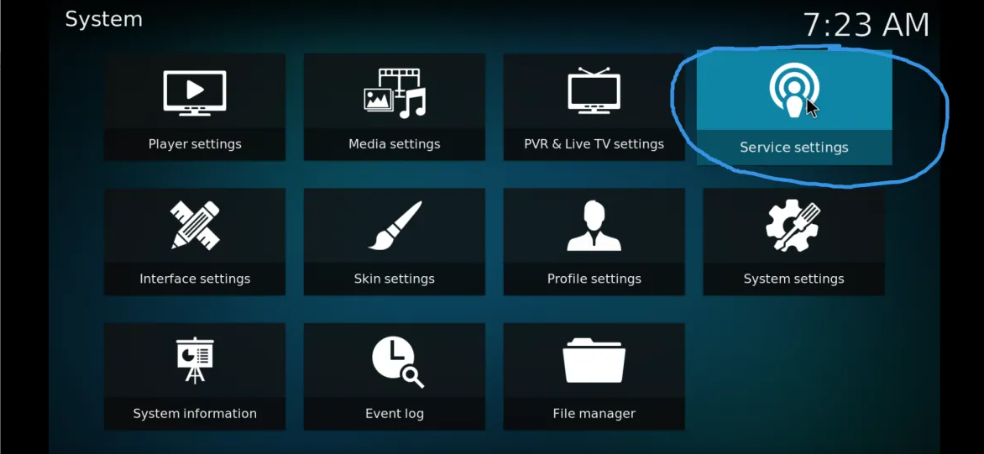

# 树莓派手机投屏

自己动手实现通过树莓派进行手机投屏。

## 准备条件

### 硬件

- Raspberry 4B
- HDMI
- 支持HDMI接口的电视机或显示器

### Software

- Debian GNU/Linux 11 (bullseye)

## 设置

### Install Kodi

```sh

sudo apt-get update
sudo apt-get install kodi

```

### 设置Kodi

1. 打开Kodi,点击齿轮进入系统设置

2. 选择服务设置

3. UPnP 中开启远端设备（局域网种的手机）通过UPnP控制KODI所在的设备（树莓派）


4. 打开AirPlay:


## 测试投屏

在iPhone上的咪咕视频软件播放视频，成功投影到树莓派上的kodi。


## Reference

1. <https://kodi.tv/>
