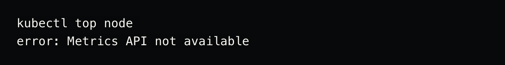

# Hands-On Lab: Enable Kubernetes Metrics Server on Docker Desktop

## Prerequisites

- Install Docker Desktop
- Enable Kubernetes on Docker Desktop


Metrics server isn't included with Docker Desktop's installation of Kubernetes.

So if you run the below commands you may see messages like: error: Metrics API not available



## Steps to Enable it

```sh

wget https://github.com/kubernetes-sigs/metrics-server/releases/download/v0.6.3/components.yaml

# Edit the components.yaml and add the line --kubelet-insecure-tls under the args section for the container spec.

kubectl apply -f components.yaml

```

Now if you execute the `kubectl top node` & `kubectl top pod -A` commands you should see the output:

